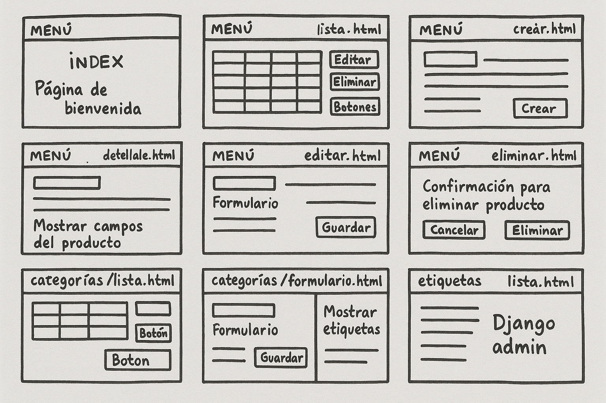

### Evaluación del módulo

Imagina que trabajas en una empresa que necesita una aplicación web para gestionar una lista de productos y sus categorías. Los productos deben tener un nombre, una descripción, un precio y estar asociados a una categoría. La aplicación debe permitir la gestión de estos productos a través de las operaciones CRUD: crear, leer, actualizar y eliminar productos.

Además, se requiere que implementes:

1. Conexión a PostgreSQL: Configurar la base de datos y conectar Django a PostgreSQL.  
2. Modelos de Datos: Crear modelos para Producto y Categoría:  
   * El modelo Producto debe tener campos como nombre, descripción, precio y una relación con el modelo Categoría.  
   * El modelo Categoría debe ser una entidad independiente que se relaciona con muchos productos.  
3. También deberás implementar las siguientes relaciones:  
   * Relación Muchos a Uno: Un producto pertenece a una sola categoría, pero una categoría puede tener muchos productos.  
   * Relación Muchos a Muchos: Imagina que los productos pueden tener más de una etiqueta asociada, para lo cual deberás crear un modelo Etiqueta y asociarlo a Producto mediante una relación muchos a muchos.  
   * Relación Uno a Uno: Crea una relación entre los productos y sus detalles (pueden ser campos como dimensiones o peso), donde cada producto tenga un conjunto único de detalles.  
4. Migraciones en Django: Utiliza las migraciones para crear las tablas correspondientes en la base de datos. Recuerda que las migraciones deben ser gestionadas correctamente para reflejar cambios en los modelos.  
5. Operaciones CRUD: Desarrolla vistas y formularios para que los usuarios puedan:  
   * Crear un nuevo producto.  
   * Ver la lista de productos.  
   * Editar un producto.  
   * Eliminar un producto.  
6. Consultas con el ORM de Django:  
   * Utiliza el ORM para recuperar productos de la base de datos con diferentes filtros. Practica la búsqueda por nombre y por categoría.  
   * Realiza consultas avanzadas usando el ORM, como buscar productos con precios mayores que un valor específico o recuperar productos por categoría.  
   * Ejercicios con exclude(), filter(), y anotaciones.  
7. SQL Personalizado: Si es necesario, realiza consultas SQL personalizadas usando raw() para obtener información más compleja o que no puede ser fácilmente obtenida mediante el ORM de Django.  
8. Seguridad:  
   * Asegúrate de que las vistas y formularios estén protegidos contra ataques CSRF.  
   * Configura correctamente el middleware de seguridad de Django para manejar sesiones y autenticación de usuarios.  
9. Interacción con las Aplicaciones Preinstaladas:  
   * Explora y utiliza algunas de las aplicaciones preinstaladas de Django como django.contrib.auth para la autenticación de usuarios y django.contrib.admin para gestionar los productos de manera más eficiente desde una interfaz administrativa.

Requisitos

* Configuración de la base de datos: La aplicación debe estar conectada a una base de datos PostgreSQL.  
* Operaciones CRUD: Deben implementarse correctamente las operaciones de creación, lectura, actualización y eliminación de productos.  
* Modelos: Los modelos deben reflejar las relaciones entre productos, categorías y etiquetas.  
* Consultas avanzadas: Implementa consultas usando filtros y consultas personalizadas en el ORM.  
* Migraciones: Utiliza correctamente las migraciones de Django para gestionar el esquema de la base de datos.  
* Seguridad: Asegúrate de que tu aplicación esté protegida contra vulnerabilidades comunes, como ataques CSRF.

Representación detallada de cada ruta y que esperar en cada página

Wireframe conceptual del sistema (versión texto)

1\. Página de Inicio (/)

* Bienvenida al sistema  
* Enlaces a las secciones: Productos, Categorías, Etiquetas, y Detalles

2\. Lista de Productos (/productos/)

* Tabla con nombre, descripción, precio, categoría  
* Botones: Ver, Editar, Eliminar

3\. Crear Producto (/productos/crear/)

* Formulario con: nombre, descripción, precio, categoría (dropdown), etiquetas (checkbox multiple), detalles (campos de dimensión, peso)

4\. Ver Producto (/productos/\<int:id\>/)

* Página de detalle con todos los datos del producto, etiquetas y detalles

5\. Editar Producto (/productos/\<int:id\>/editar/)

* Mismo formulario de creación, precargado con datos del producto

6\. Eliminar Producto (/productos/\<int:id\>/eliminar/)

* Confirmación para eliminar producto

7\. Lista de Categorías (/categorias/)

* Tabla de categorías  
* Botón para crear nueva categoría

8\. Crear/Editar/Eliminar Categoría

* Formularios simples para administrar las categorías

9\. Lista de Etiquetas (/etiquetas/)

* Listado con CRUD de etiquetas

Páginas por desarrollar

| Página | Tipo de vista | Descripción |
| ----- | ----- | ----- |
| index.html | Template | Página de bienvenida |
| productos/lista.html | Lista | Mostrar productos en tabla con acciones CRUD |
| productos/crear.html | Formulario | Crear nuevo producto |
| productos/detalle.html | Detalle | Mostrar todos los campos del producto |
| productos/editar.html | Formulario | Editar producto existente |
| productos/eliminar.html | Confirmación | Confirmación para eliminar producto |
| categorias/lista.html | Lista | Mostrar categorías con opción de editar/eliminar |
| categorias/formulario.html | Formulario | Crear/editar categoría |
| etiquetas/lista.html | Lista | Mostrar etiquetas |
| etiquetas/formulario.html | Formulario | Crear/editar etiqueta |
| admin/ | Django admin | Uso del admin para gestionar modelos fácilmente |



Rutas a implementar (URLConf)

```py
from django.urls import path
from . import views

urlpatterns = [
    # Página de inicio
    path('', views.index, name='index'),

    # Productos
    path('productos/', views.lista_productos, name='lista_productos'),
    path('productos/crear/', views.crear_producto, name='crear_producto'),
    path('productos/<int:id>/', views.detalle_producto, name='detalle_producto'),
    path('productos/<int:id>/editar/', views.editar_producto, name='editar_producto'),
    path('productos/<int:id>/eliminar/', views.eliminar_producto, name='eliminar_producto'),

    # Categorías
    path('categorias/', views.lista_categorias, name='lista_categorias'),
    path('categorias/crear/', views.crear_categoria, name='crear_categoria'),
    path('categorias/<int:id>/editar/', views.editar_categoria, name='editar_categoria'),
    path('categorias/<int:id>/eliminar/', views.eliminar_categoria, name='eliminar_categoria'),

    # Etiquetas
    path('etiquetas/', views.lista_etiquetas, name='lista_etiquetas'),
    path('etiquetas/crear/', views.crear_etiqueta, name='crear_etiqueta'),
    path('etiquetas/<int:id>/editar/', views.editar_etiqueta, name='editar_etiqueta'),
    path('etiquetas/<int:id>/eliminar/', views.eliminar_etiqueta, name='eliminar_etiqueta'),
]
```

Entregables

* Un repositorio con el código completo de la aplicación.  
* Capturas de pantalla que muestren la interfaz administrativa de Django y las vistas CRUD en acción.  
* Un archivo README explicando cómo ejecutar la aplicación localmente.